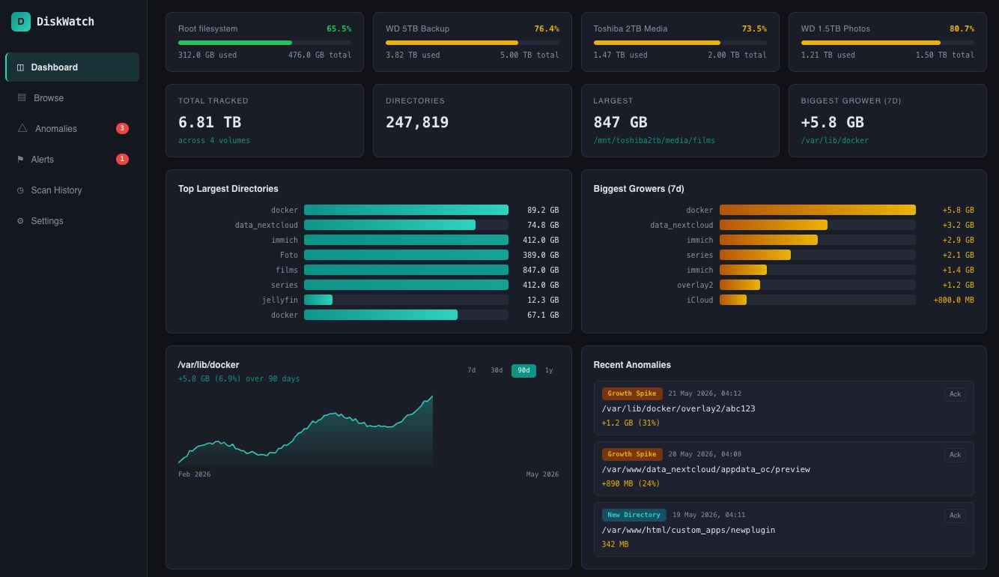

# DiskWatch

DiskWatch is a self-hosted webapp for tracking disk usage of your filesystems over time, down to arbitrary folder depth. It runs periodic scans, stores historical data in SQLite, and lets you browse usage trends, spot growth spikes, and receive alerts when thresholds are exceeded.



---

## Installation

**Requirements:** Python 3.10+, systemd, a non-root service user (detected automatically from `$SUDO_USER` when running `sudo bash install.sh`).

```bash
sudo bash install.sh
```

The installer:
- Creates `/var/www/diskwatch/app/` with a Python virtualenv.
- Installs dependencies from `requirements.txt`.
- Copies all app files into place.
- Writes a default `config.yaml` if none exists.
- Installs and enables the `diskwatch` systemd service.

---

## First collection

Run the collector wrapper manually as root to populate initial data:

```bash
sudo /var/www/diskwatch/app/collect.sh
```

`collect.sh` runs the collector as root (needed to read all directories), then restores ownership of the SQLite database files to the service user so the web server can read them.

For a dry run (no database writes):

```bash
sudo /var/www/diskwatch/app/collect.sh --dry-run
```

---

## Cron job

Add to **root's** crontab (`sudo crontab -e`) to run daily at 04:00:

```
0 4 * * * /var/www/diskwatch/app/collect.sh >> /var/log/diskwatch-collector.log 2>&1
```

---

## Accessing the UI

The server listens on `127.0.0.1:8070`. Access it via your reverse proxy (nginx recommended), or directly at `http://<server-ip>:8070` if you open the port.

On first visit, you will be prompted to set the admin password. After that, all routes require login.

---

## Configuration reference

All settings are editable via the **Settings** view in the UI. The config file lives at `/var/www/diskwatch/app/config.yaml`.

| Section | Key | Description |
|---------|-----|-------------|
| `auth` | `session_timeout_hours` | How long login sessions last (default 72h) |
| `scan.roots` | `path`, `label`, `exclude` | Filesystems to scan and paths to skip |
| `retention` | `keep_days`, `cleanup_after_scan` | How long to keep historical data |
| `email` | `smtp_host`, `smtp_port`, … | SMTP settings for email alerts |
| `ntfy` | `server_url`, `topic`, … | ntfy push notification settings |
| `alerts.rules` | `name`, `path`, `type`, `threshold_*` | Alert rules (absolute_growth or usage_percent) |
| `display` | `default_time_range_days`, `theme` | UI preferences |

---

## Service management

```bash
systemctl status diskwatch
systemctl restart diskwatch
journalctl -u diskwatch -f
```

---

## Reverse proxy (nginx example)

```nginx
server {
    listen 80;
    server_name diskwatch.example.com;

    location / {
        proxy_pass http://127.0.0.1:8070;
        proxy_set_header Host $host;
        proxy_set_header X-Real-IP $remote_addr;
    }
}
```
